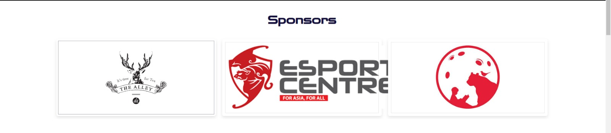
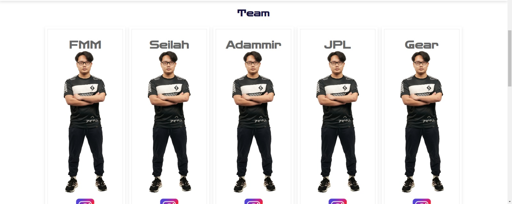
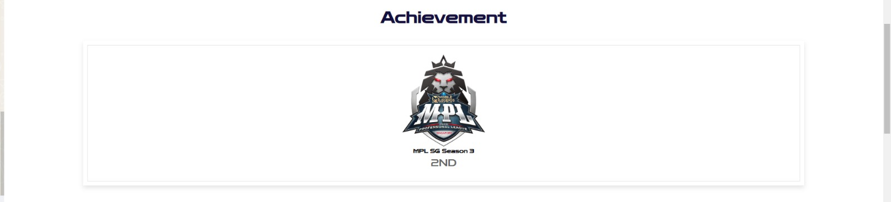
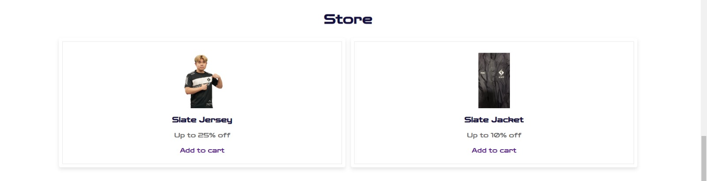
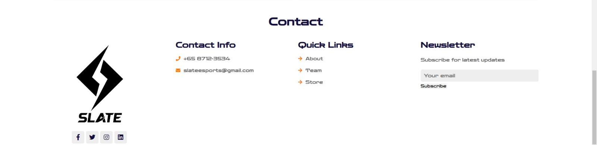

# ASG1
Interactive Development Assignment 1

I will be creating an advertising page for slate esports. This page will include the team's information e.g. social media, contact information, merchandise etc. 

## Design Process

This website is made for the fans who wish to support the team. It is also for people who do not know about the team to learn about slate esports.

As a user,
- I want to find out what slate esports is about
- I want to know who are representing slate esports
- Achievements they have
- Store for merchandise
- Ways to contact them

[Wireframe](ID_S10239969_Ng%20Bi%20De_Assg1_wireframe.xd)

[VideoWalkthrough](https://connectnpedu.sharepoint.com/:v:/r/sites/CHICKENRICEGPA/Shared%20Documents/General/Recordings/New%20channel%20meeting-20221204_202321-Meeting%20Recording.mp4?csf=1&web=1&e=p2vwbA)

## Features
1. Navigation Bar
    - clicking on the cart will pop out the cart

2. About - shows what slate esports is about 

3. Sponsors - shows sponsors of slate esports
    - sliding effect of images

  
4. Team - information about the team and their social media links
    - hovering over the profile shows hover effects 
    - click on to social media links

  
5. Achievement - shows achievement of the team

6. Store - shows the merchandise available for sale

7. Contact - ways to contact slate esports

### Features Left to Implement

1. Newsletter subscription 
    - send a email to email inputted

2. Checkout page
    - checkout page for payments of merchandise

3. News 
    - updated news of team e.g. Upcoming matches

## Technologies Used

- [AdobeXD](https://www.adobe.com/products/xd/learn/get-started.html)
    - I used AdobeXD for my wireframe to have an idea of my website

- [VisualStudioCode](https://code.visualstudio.com/)
    - This is where the html, css and js goes into

- [AdobePhotoshop](https://www.adobe.com/sg/products/photoshop/landpa.html?gclid=CjwKCAiAp7GcBhA0EiwA9U0mthPHMmUN0r3KAVQa2iYxD4C4GW2yw_k6hlvRxae79slFO2CKh-kt3BoCdRkQAvD_BwE&sdid=YP7XGDLR&mv=search&ef_id=CjwKCAiAp7GcBhA0EiwA9U0mthPHMmUN0r3KAVQa2iYxD4C4GW2yw_k6hlvRxae79slFO2CKh-kt3BoCdRkQAvD_BwE:G:s&s_kwcid=AL!3085!3!444551129026!e!!g!!photoshop!184169684!12788303444)
    - I used photoshop to edit some of the photo background color

- [Swiper](https://swiperjs.com/get-started)
    - Sponsors swiper

## Testing

1. Shopping cart:
    1. Go to "Store" section
    2. "Add to cart" 
    3. The items should add to cart
    4. Quantity amount should decrease when clicking on bin
    5. Clicking on checkout should bring to checkout page with the correct total amount

2. Navigation bar:
    1. Try clicking on "Team", "About" or "Store"
    2. Clicking on them should bring user to the correct section

### Different screen sizes

- Navigation bar goes missing when screen size is too small.
  
- Layout of website looks weird when screen size is too small.
  
- Team layout only looks normal on a big screen size.
  

## Credits

### Media

#### [About slate](https://mobile.twitter.com/aviumesports)
#### [Bin](https://www.subpng.com/png-m5is5t/)
#### [Caravan Studio](https://www.linkedin.com/company/caravanstudios/)
#### [Cart](https://www.pngegg.com/en/png-dhljn)
#### [EsportsCenter](https://www.facebook.com/thegymgg/posts/we-are-officially-known-as-esportscentre-to-be-inline-with-our-registered-entity/313665866686204/)
#### [Instagram](https://www.logo.wine/logo/Instagram)
#### [MPL SG](https://www.facebook.com/mpl.sg.official/)
#### [Slate logo](https://en.wikipedia.org/wiki/Slate_Esports)
#### [TheAlley](https://www.sunwayvelocitymall.com/directory/the-alley)
#### [Tiktok](https://pixabay.com/vectors/search/tiktok/)
#### [Twitch](https://icon-icons.com/icon/twitch-logo/189242)

### Acknowledgements

#### https://www.evos.gg/
#### https://teamrrq.com/
#### https://www.rsg.gg/
